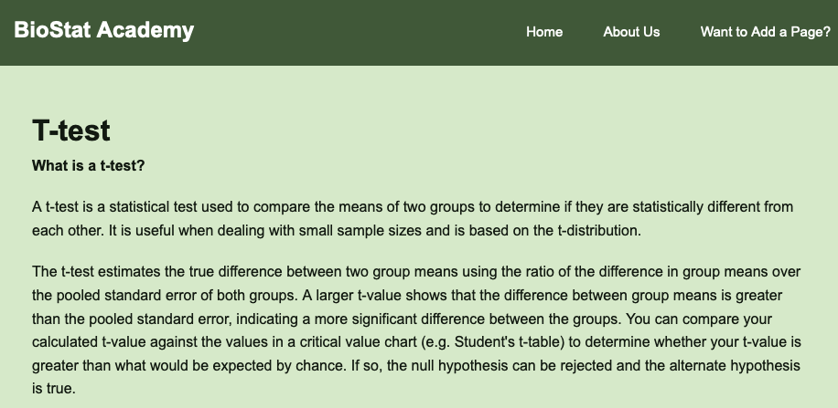
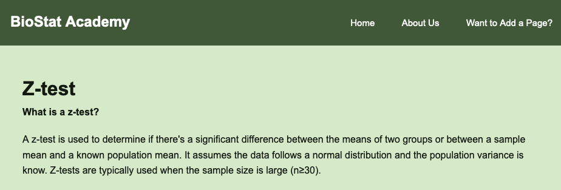
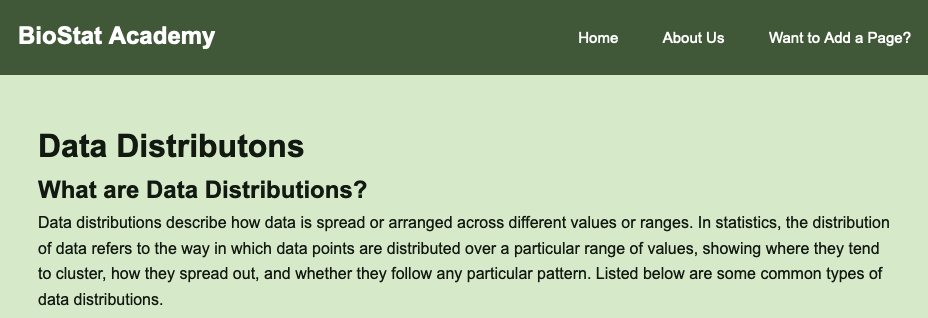
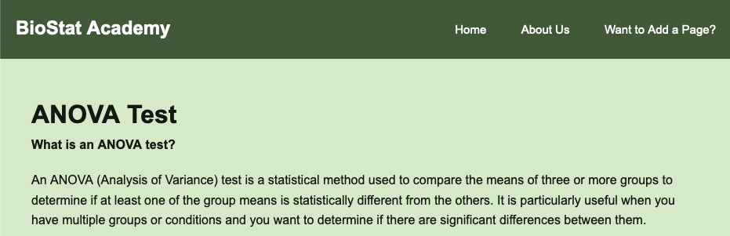

# BioStat Academy
## CSCI 6118 Project - Interactive App to Teach Basic Statistics to Biologists

## Project Overview

This interactive app is designed to help biologists learn and apply basic statistical concepts essential for analyzing biological data, conducting experiments, and drawing valid conclusions. Statistics is a critical tool for biologists in fields such as genetics, ecology, and epidemiology, enabling them to make evidence-based decisions and communicate findings effectively. Our app provides an easy-to-use platform for mastering key statistical techniques commonly used in biological research.

## Why Statistics for Biologists?

Biologists frequently work with large datasets, and statistical analysis helps make sense of complex biological information. The app helps users:

- Analyze biological data (e.g., gene expression, species population)
- Design experiments with scientifically rigorous methods
- Make inferences and test hypotheses
- Understand relationships between variables
- Visualize and interpret results

## Core Statistical Concepts Covered

The app provides a hands-on introduction to five key statistical methods frequently used in biological research:

### 1. **T-Tests (Two-Sample and Paired)**

T-tests compare the means of two groups to assess whether any observed differences are statistically significant.

- **Two-Sample T-Test**: Compares means of two independent groups.  
  - *Example*: Comparing plant height between two different fertilizer treatments.

- **Paired T-Test**: Compares measurements from the same group under two conditions.  
  - *Example*: Measuring before-and-after weight changes in fish exposed to a drug.
  


### 2. **Z-Test**

The z-test compares a sample mean to a population mean, typically used when the sample size is large.

- *Example*: Testing if the average height of a species of tree has changed compared to historical data.



### 3. **Data Distributions**

Understanding data distributions is key to selecting the right statistical tests.

- **Normal Distribution**: Often used to model biological data such as body sizes or enzyme activity.  
  - *Example*: Determining probabilities of measuring a certain enzyme level in a sample.

- **Binomial & Poisson Distributions**: Used for categorical or count-based data.  
  - *Example*: Modeling the probability of an event occurring (e.g., a species' presence in different habitats).



### 4. **ANOVA (Analysis of Variance)**

ANOVA tests whether there are significant differences between the means of three or more groups.

- **One-Way ANOVA**: Compares the means across multiple groups for one factor.  
  - *Example*: Comparing plant growth under different light conditions.

- **Two-Way ANOVA**: Evaluates two independent variables and their interaction.  
  - *Example*: Examining how both water and fertilizer affect plant growth.



### 5. **Regression Analysis (Linear and Multiple)**

Regression helps to model relationships between variables.

- **Linear Regression**: Models the relationship between one independent and one dependent variable.  
  - *Example*: Modeling the effect of temperature on algae growth.

- **Multiple Regression**: Assesses multiple predictors simultaneously.  
  - *Example*: Analyzing how light, temperature, and soil type together affect plant growth.

## Interactive Features

The app incorporates several engaging, interactive features to enhance the learning experience:

- **Data Visualizations**: Interactive graphs (e.g., histograms, scatter plots, box plots) to help users visualize distributions, regression lines, and test results.
- **Code Examples and Walkthroughs**: Step-by-step guides and sample code to show users how to apply statistical tests in practice.
- **Quiz**: A built-in quiz feature to test knowledge, with immediate feedback to reinforce concepts and improve understanding.

## Example Scenarios

1. **Ecology**: A biologist compares species diversity in two habitats using a **t-test** to determine if the difference is significant.
2. **Genetics**: A researcher tests if a new drug affects the growth of bacteria using a **z-test** to compare growth rates.
3. **Clinical Trials**: An **ANOVA** is used to test the effects of three drug treatments on patient outcomes.
4. **Environmental Science**: A study uses **linear regression** to predict plant growth based on temperature data.

## Conclusion

This app provides biologists with the statistical tools they need to analyze data, design experiments, and draw meaningful conclusions. By focusing on essential techniques like t-tests, z-tests, ANOVA, and regression analysis, the app helps users build a strong foundation in statistics, making complex data more accessible and interpretable.

## CSCI 6118 Project - Interactive App to Teach Basic Statistics to Biologists

## Project Overview

This interactive app is designed to help biologists learn and apply basic statistical concepts essential for analyzing biological data, conducting experiments, and drawing valid conclusions. Statistics is a critical tool for biologists in fields such as genetics, ecology, and epidemiology, enabling them to make evidence-based decisions and communicate findings effectively. Our app provides an easy-to-use platform for mastering key statistical techniques commonly used in biological research.

## Why Statistics for Biologists?

Biologists frequently work with large datasets, and statistical analysis helps make sense of complex biological information. The app helps users:

- Analyze biological data (e.g., gene expression, species population)
- Design experiments with scientifically rigorous methods
- Make inferences and test hypotheses
- Understand relationships between variables
- Visualize and interpret results

## Core Statistical Concepts Covered

The app provides a hands-on introduction to five key statistical methods frequently used in biological research:

### 1. **T-Tests (Two-Sample and Paired)**

T-tests compare the means of two groups to assess whether any observed differences are statistically significant.

- **Two-Sample T-Test**: Compares means of two independent groups.  
  - *Example*: Comparing plant height between two different fertilizer treatments.

- **Paired T-Test**: Compares measurements from the same group under two conditions.  
  - *Example*: Measuring before-and-after weight changes in fish exposed to a drug.
  


### 2. **Z-Test**

The z-test compares a sample mean to a population mean, typically used when the sample size is large.

- *Example*: Testing if the average height of a species of tree has changed compared to historical data.


### 3. **Data Distributions**

Understanding data distributions is key to selecting the right statistical tests.

- **Normal Distribution**: Often used to model biological data such as body sizes or enzyme activity.  
  - *Example*: Determining probabilities of measuring a certain enzyme level in a sample.

- **Binomial & Poisson Distributions**: Used for categorical or count-based data.  
  - *Example*: Modeling the probability of an event occurring (e.g., a species' presence in different habitats).


### 4. **ANOVA (Analysis of Variance)**

ANOVA tests whether there are significant differences between the means of three or more groups.

- **One-Way ANOVA**: Compares the means across multiple groups for one factor.  
  - *Example*: Comparing plant growth under different light conditions.

- **Two-Way ANOVA**: Evaluates two independent variables and their interaction.  
  - *Example*: Examining how both water and fertilizer affect plant growth.


### 5. **Regression Analysis (Linear and Multiple)**

Regression helps to model relationships between variables.

- **Linear Regression**: Models the relationship between one independent and one dependent variable.  
  - *Example*: Modeling the effect of temperature on algae growth.

- **Multiple Regression**: Assesses multiple predictors simultaneously.  
  - *Example*: Analyzing how light, temperature, and soil type together affect plant growth.

## Interactive Features

The app incorporates several engaging, interactive features to enhance the learning experience:

- **Data Visualizations**: Interactive graphs (e.g., histograms, scatter plots, box plots) to help users visualize distributions, regression lines, and test results.
- **Code Examples and Walkthroughs**: Step-by-step guides and sample code to show users how to apply statistical tests in practice.
- **Quiz**: A built-in quiz feature to test knowledge, with immediate feedback to reinforce concepts and improve understanding.

## Example Scenarios

1. **Ecology**: A biologist compares species diversity in two habitats using a **t-test** to determine if the difference is significant.
2. **Genetics**: A researcher tests if a new drug affects the growth of bacteria using a **z-test** to compare growth rates.
3. **Clinical Trials**: An **ANOVA** is used to test the effects of three drug treatments on patient outcomes.
4. **Environmental Science**: A study uses **linear regression** to predict plant growth based on temperature data.

## Conclusion

This app provides biologists with the statistical tools they need to analyze data, design experiments, and draw meaningful conclusions. By focusing on essential techniques like t-tests, z-tests, ANOVA, and regression analysis, the app helps users build a strong foundation in statistics, making complex data more accessible and interpretable.


## Installation 
Clone the repository in your command line by:
```
git clone https://github.com/hbrackney/StatsApp.git
```
 All specific dependencies are included in the ` environment.yaml` file. Create environment with required dependencies using the `environment.yaml` file: 
```
conda env create -f environment.yaml
```
And then activate the environment:
```
conda activate StatsApp
```
Step into the repository by: (for Mac or Windows users)
```
cd StatsApp 
```

## Usage
From command line or in visual studio terminal, run the server.py file: 
```
python app.py
``` 
Go to your preferred browser and enter 
```
localhost:1000
```
The website is now live! 

To end the website run and to regain typing ability in command line or terminal press `Crtl + C`. 

## Changelog
02-12-2024 (HB): Fixed Page mapping and added more comments to dash_apps.py and tests </br>
01-12-2024 (SS): Completed Regressions page. Note: I added scikit-learn to the dependencies, so install that before running again. </br>
19-11-2024 (LS): Added description to the About page. </br>
19-11-2024 (LS): Updated t-test page and added python/R examples
19-11-2024 (LS): Added ANOVA page with tests for the dash apps and plots, and added python/R examples </br>
19-11-2024 (LS): Added description to the About page. </br>
19-11-2024 (LS): Updated t-test page and added python/R examples
19-11-2024 (LS): Added ANOVA page with tests for the dash apps and plots, and added python/R examples </br>
19-11-2024 (HB): Changed ReadME.md installation instructions to be more through. <br/>
19-11-2024 (HB): Fixed Quiz on Distributions Page. Added more tests for plots.py and app.py. <br/>
18-11-2024 (LS): Updated and expanded README and CONTRIBUTING to include background info and description. </br>
18-11-2024 (HB): Filled in Reference page to explain more and be more of a template. </br>
18-11-2024 (HB): Added a figure on the home page that flips between images from some of the pages. </br>
18-11-2024 (HB): Added python and R examples to Distributions Page. Added code/precode styles to the styles.css file. </br>
12-11-2024 (SS): Added quiz to z-test page and added more thorough docstrings. </br>
11-11-2024 (HB): Added Distribution Page with tests for the dash apps and plots. </br>
06-11-24 (SS): Added example python script to z-test page and updated about page. <br/>
### Version 0
This version is an initial build to test basic functions and usablity. </br>
</br>
30-10-2024 (LS): Added and fixed tests in the test_dash_apps.py through dash.testing. </br>
30-10-2024 (HB): Removed t_quiz.py/quizzes.py (and corresponding test files). Corrected quiz code in t-test.html. Added tests for dash_apps.py and plots.py</br>
30-10-2024 (SS): Updated data tabes and plots for z-test page so that an updated box plot, z-statistic value, and p-value are correctly displayed when the user inputs new data points into the table. </br>
25-10-2024 (HB): Spilt app.py into app.py, dash_apps.py, plots.py to make things easier to read. </br>
25-10-2024 (SS): Added z-test example info to the z-test page </br>
23-10-2024 (HB): Added a knowledge quiz to the t-test page<br/>
23-10-2024 (HB): Added tests for app initialization <br/>
23-10-2024 (HB): Added a navigation bar <br/>
23-10-2024 (SS): Fixed formatting errors on z-test page <br>
21-10-2024 (SS): Added z-test text information <br/>
21-10-2024 (LS): Added t-test text information with images and updated general formatting <br/>
16-10-2024 (HB): Added interactive plots to the content pages (t test, z test, example page) <br/>
07-10-2024 (HB): Changed type entry box to dropdown menu for users <br/>
07-10-2024 (HB): Added "Return Home" button to each page <br/>
07-10-2024 (HB): Created template html files to create inital GUI <br/>
07-10-2024 (HB): Created server.py file to create web app <br/>
